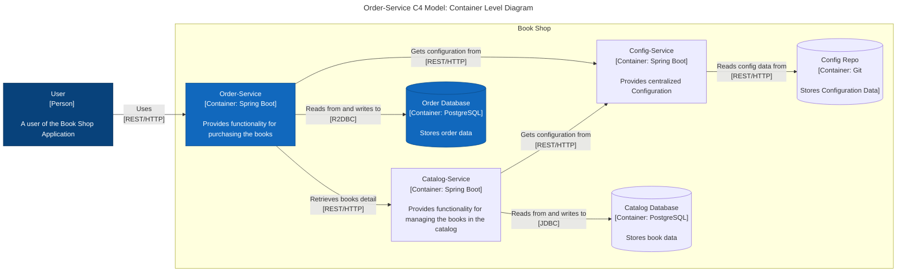

# order-service
This is stores the details of all the orders that system have. It also expose the apis to perform crud on Order domain.

## API Spec for order-service

| Endpoint | HTTP Method | Request Body | Status | Response Body | Description                                            |
|----------|-------------|--------------|--------|---------------|--------------------------------------------------------|
| /orders  | POST        | OrderRequest | 200    | Order         | Submits a new order for given book in a given quantity |
| /orders  | GET         |              | 200    | Order[]       | Retrieve all Orders                                    |

